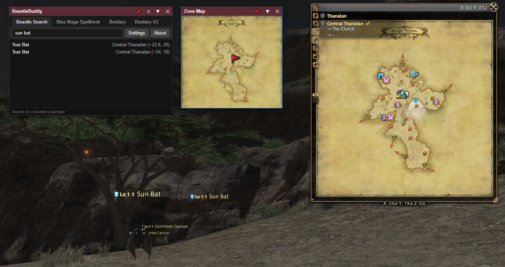

# BeastieBuddy

BeastieBuddy is a Final Fantasy XIV companion application for searching creatures and displaying their locations on an in-game-style map.




## Features

* Beast/Mob search
* Creature location information
* Zone map display
* Location marker
* Always-on-top map window
* Adjustable map opacity
* Map window roll-up
* FFXIV zone and map resolution through XIVAPI

## Requirements

For normal use, download an official BeastieBuddy release.

Building from source requires:

* Node.js
* npm
* Rust
* Tauri 2
* A Windows development environment for Windows builds

## Building

Install the JavaScript dependencies:

```bash
npm install
```

Build the frontend:

```bash
npm run build
```

Build the Windows application without creating an installer:

```bash
npx tauri build --no-bundle
```

The resulting executable is produced under:

```text
src-tauri/target/release/
```

## Source Availability

The complete source code is provided publicly for inspection, security review, educational purposes, and personal non-commercial builds.

Public availability of this repository does not mean that the project is licensed under an open-source license.

## License

BeastieBuddy is proprietary software.

The source code is provided under the accompanying `LICENSE` file.

You may inspect the source and build BeastieBuddy for personal, non-commercial use. Redistribution, commercial use, sublicensing, and distribution of modified versions require prior written permission.

## Third-Party Services

BeastieBuddy may communicate with external services required for functionality, including the BeastieBuddy API and XIVAPI.

Those services are independent of this repository and may have their own terms, availability, and limitations.

## Final Fantasy XIV

BeastieBuddy is a third-party fan-made application and is not affiliated with or endorsed by Square Enix.

FINAL FANTASY XIV and related names and assets are trademarks and/or property of Square Enix Holdings Co., Ltd. and/or its affiliates.

## Disclaimer

BeastieBuddy is provided without warranty. Use it at your own risk.

The copyright holder is not responsible for problems resulting from the use, modification, or compilation of the software.
