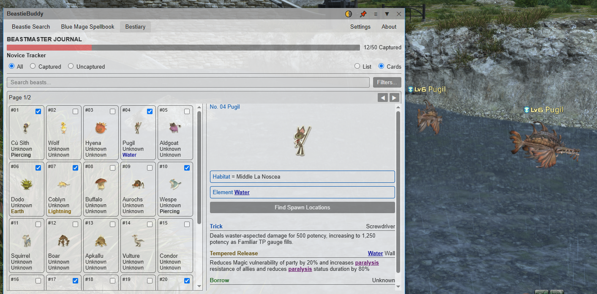
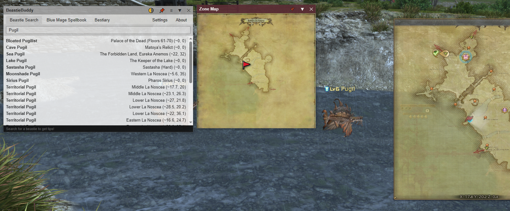
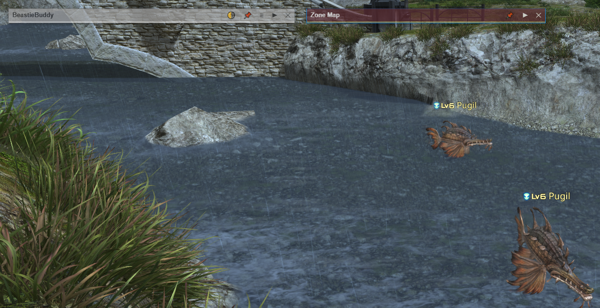
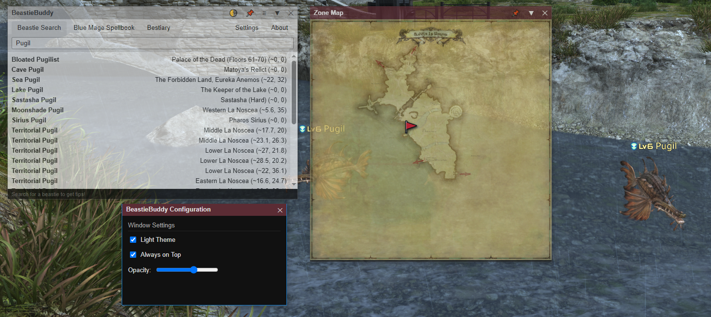
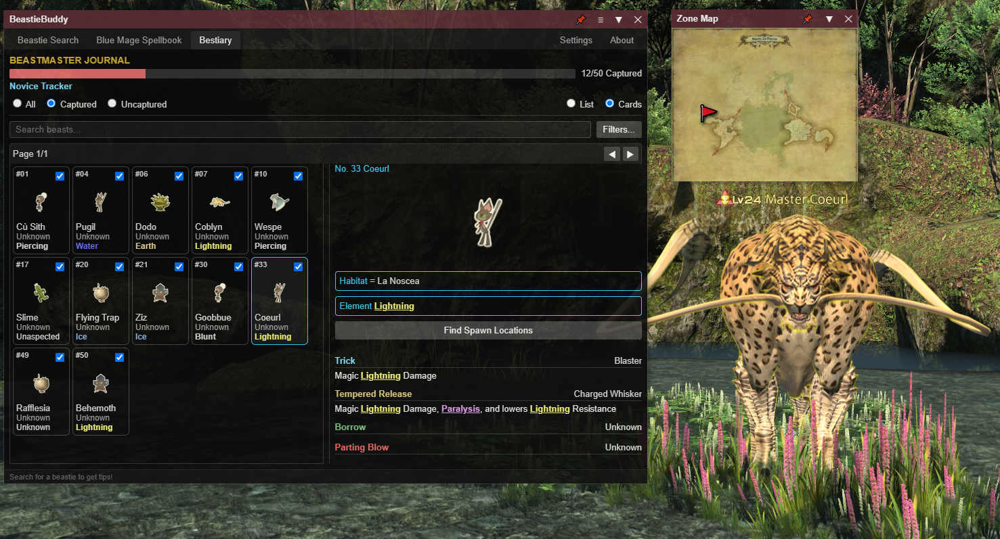
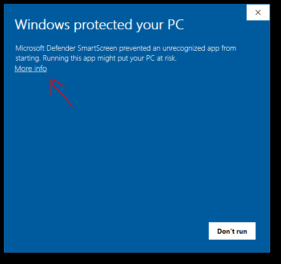
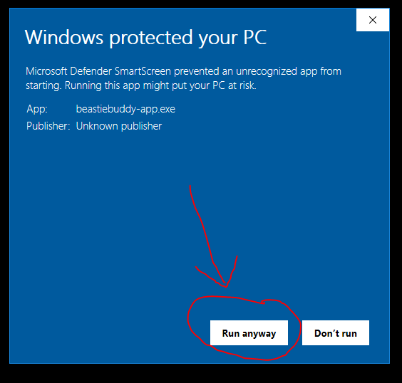

#  BeastieBuddy

BeastieBuddy is a Final Fantasy XIV companion Windows desktop application for searching creatures and displaying their locations on an in-game-style map.
<br>

<br>

<br>

<br>



<br>

## Download

[**Download BeastieBuddy for Windows**](https://github.com/rail2025/BeastieBuddy-APP/releases/latest/download/beastiebuddy-app.exe)

No installer. Download the `.exe` and run it.

### Windows Security Warning

Because I don't pay hundreds of dollars a year for a commercial code-signing certificate, Windows SmartScreen is going to scream at you with an "Unknown publisher" warning when you launch the app for the first time.

It does **not** mean that the app has malware.

BeastieBuddy's code is available in this repository for inspection, and you can build the application yourself if you prefer.

If you downloaded BeastieBuddy from this official GitHub repository/release:

1. Click **More info** on the Windows warning.
   

3. Verify that you downloaded the file from this repository.
4. Click **Run anyway** to launch BeastieBuddy.
   

### Download Verification

The official Windows executable can be verified using its SHA-256 checksum.

**Current Windows EXE v1.0.5.0 SHA-256:**

`sha256:c1c8c06dd65e4377933115e3a7d4273646f13dc8582c798199d2dba79eb5e699`

To calculate the SHA-256 checksum of a downloaded file in Windows PowerShell:

Get-FileHash .\beastiebuddy-app.exe -Algorithm SHA256


## Features

* Beast/Mob search
* Creature location information
* Zone map display
* Location marker
* Always-on-top map window
* Adjustable map opacity
* Map window roll-up
* FFXIV zone and map resolution through XIVAPI

## Requirements

For normal use, download an official BeastieBuddy release.

Building from source requires:

* Node.js
* npm
* Rust
* Tauri 2
* A Windows development environment for Windows builds

## Building

The resulting executable is produced under:
```text
src-tauri/target/release/
```

## Source Availability

BeastieBuddy is proprietary software.
I’m keeping the source code public so anyone can inspect the security, review the code, or build it for personal use. However, please note that this is a proprietary solo project. You're totally welcome to look under the hood and use it for yourself, but please don't redistribute it, sell it, or post modified versions without checking with me first.

## Third-Party Services

BeastieBuddy relies on my search API and XIVAPI. If those are down things will break. Search results for the former, map displays for the latter.

## Final Fantasy XIV

BeastieBuddy is a third-party fan-made application and is not affiliated with or endorsed by Square Enix.
FINAL FANTASY XIV and related names and assets are trademarks and/or property of Square Enix Holdings Co., Ltd. and/or its affiliates.

## Disclaimer

BeastieBuddy is provided without warranty. Use it at your own risk.

I'm not responsible for any issues, bugs, or problems that happen from using, modifying, or building this software.
